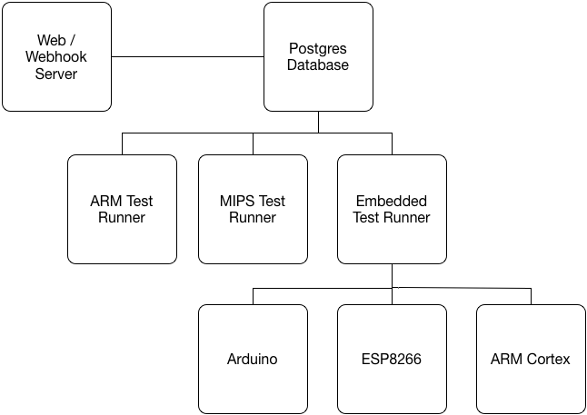

# Simple-CI

A very simple continuous integration server.

## Development Goals

While there are a large number of CI solutions available, Simple-CI aims to
be extremely small and distributed, with the ability to run on very small
platforms, such as the Raspberry Pi, MIPS Creator, as well as to have drivers
for embedded platforms.

## Architecture

Simple-CI is built to be a distributed solution, where a web front-end can
provide build and test status as well as webhooks, runners can build and run
the tests on multiple platforms, and can drive embedded systems.



Each platform that a test runs on is defined by the configuration set up in
`config.json`.  For instance, if a _test runner_ is set up for a platform
called `armv7` is configured, it will listen for commits that are set up to
run on `armv7`.

### Setting up a Repository

A repository can be set up by running `add_repo`.

```
$ add_repo -r https://github.com/celcius-labs/emdb.git -n emdb -u https://github.com/celcius-labs/emdb -a x86_64 armv6 armv7 mips
```

### Current Status

* Database Configuration (done)
* Database Models (done)
* Git Integration (done)
* Basic Test Runner w/Reporting (done)
* Testing Queues (done)
* Web Interface (done)
* Github/Gitlab Webhooks (done)
* Container Isolation (not started)

## Setup

### Git Repository

In order to setup Simple-CI to build and execute tests, a `.simple-ci.json`
file must exist at the root of the repository.

#### Example .simple-ci.json

```js
{
  "setup": [
    "make clean"
  ],
  "build": [
    "make"
  ],
  "test": [
    "make test"
  ]
}
```

Any of the sections can be empty, and if at least one of them is not empty,
the build and tests will run.

### Server

The server is written with Node.js, and requires Postgres as a database store.
These requirements are likely to grow over time.  Currently, you will need to
have a working knowledge of both in order to use this package.  Over time,
those restrictions will be eased, but this package is in very early stages.

#### Setting up Postgres

First set up the database, then set up the user:

```
$ createdb ci
$ psql ci

ci=# CREATE USER ci WITH PASSWORD 'password';
CREATE ROLE
ci=# ci=# grant all privileges on database ci to ci;
GRANT
ci=# \q
```

#### Setting up Runners

```
$ cd simple-ci
$ npm install
```

From there, you will need to configure the `config.json` file, using the sample
as a template.

Each architecture should have its platform set correctly for reporting.

#### First Run

Before the first run, migrations must be run:

```
$ npm run migrate_up
```

#### Webserver

```
$ node index.js
```

#### Test Runners

The `test_runner` script will listen for tests from the redis queue every 30
seconds.

```
$ ./bin/test_runner 2>&1 >test.log &
```
